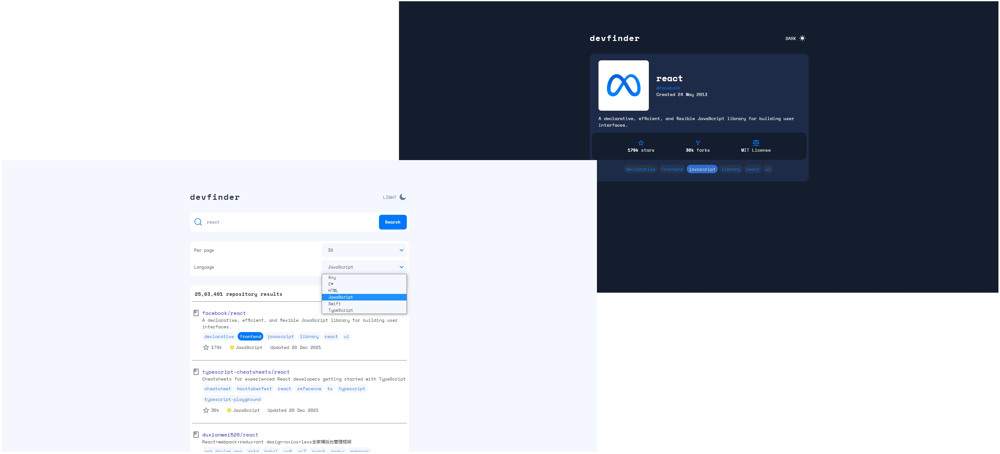

# GitHub Repository search

## Your users should be able to:

- View the optimal layout for each page depending on their device's screen size
- See hover states for all interactive elements on the page
- Toggle color theme to their preference
- Filter by language programming
- Smart search

## [Github Pages](https://megahoma.github.io/github-repository-search/#/)

## Usage

`npm i`

`npm run start`

### Coded by [megahoma](https://github.com/megahoma)
